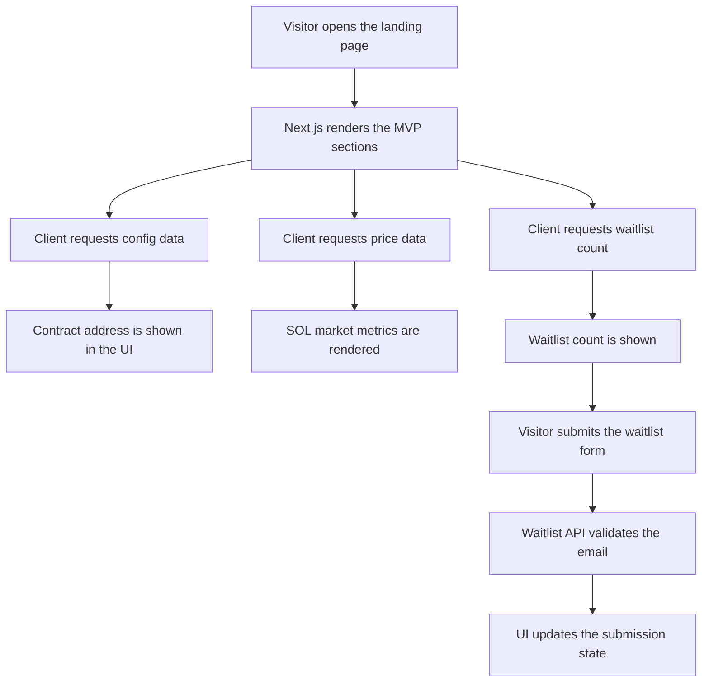

<p align="center">
  
</p>

<h1 align="center">Lumora SOL Token MVP</h1>

<p align="center">
  A SOL-native landing page MVP focused on token narrative, live market context, utility framing, roadmap clarity, and community conversion.
</p>

<p align="center">
  <a href="#overview">Overview</a> •
  <a href="#features">Features</a> •
  <a href="#architecture">Architecture</a> •
  <a href="#official-links">Official Links</a> •
  <a href="#roadmap">Roadmap</a> •
  <a href="#community-and-support">Community</a> •
  <a href="#installation">Installation</a> •
  <a href="#configuration">Configuration</a> •
  <a href="#faq">FAQ</a>
</p>

## Overview

Lumora is a product-oriented MVP for a SOL token project. The goal is not to simulate a full token platform on day one. The goal is to ship the smallest set of modules that make the project legible, credible, and actionable.

This repository focuses on:

- Explaining the token thesis clearly
- Showing live market context through a lightweight API-backed metrics module
- Presenting utility and ecosystem fit without overpromising
- Supporting wallet-facing conversion with a visible contract address and waitlist capture
- Staying easy to review, extend, and upload to GitHub

## Official Links

- X / Twitter: [https://x.com/Lumora_so](https://x.com/Lumora_so)
- Website: [https://www.lumora.cfd](https://www.lumora.cfd)
- GitHub Repository: [https://github.com/Lumo-sol/Lumora.git](https://github.com/Lumo-sol/Lumora.git)

## Brand Image Note

The README uses an HTML `` tag so the project brand image renders more reliably across GitHub viewers.

If the preview does not render in a specific client, open the asset directly:

- [`public/logo.jpg`](./public/logo.jpg)

## Features

### User-facing MVP modules

- Hero section with SOL token positioning and launch thesis
- Live metrics section powered by `/api/prices`
- Token utility and illustrative token allocation section
- Ecosystem fit and roadmap sections
- FAQ and project documentation section
- Community CTA with contract address copy and waitlist form
- Solana wallet connection modal for Phantom and Solflare
- Light and dark theme toggle

### Backend-facing MVP modules

- `/api/config` for contract address delivery and lightweight admin updates
- `/api/prices` for market context and fallback-safe token pricing
- `/api/waitlist` for validated MVP waitlist submissions

## First-Principles MVP Scope

This project follows a first-principles MVP model:

1. A token site must explain why the token exists.
2. It must connect the story to live market context.
3. It must make next actions obvious.
4. It should not pretend unfinished systems are already production-ready.

That is why the repository includes narrative, metrics, validation, configuration, and waitlist capture before more complex launch mechanics.

## Technical Architecture

### Stack

- Next.js 16 App Router
- React 19
- TypeScript
- Tailwind CSS v4
- Radix UI primitives
- Local API routes for config, pricing, and waitlist handling

### Project structure

```text
app/
  layout.tsx
  page.tsx
  api/
    config/route.ts
    prices/route.ts
    waitlist/route.ts
components/
  header.tsx
  hero-section.tsx
  live-metrics.tsx
  token-utility.tsx
  ecosystem-section.tsx
  roadmap-section.tsx
  faq-section.tsx
  docs-section.tsx
  community-cta.tsx
  wallet-provider.tsx
lib/
  validators.ts
public/
  icon.svg
  logo.jpg
```

## Process Flow



## Functional Modules

### 1. Narrative layer

- Hero section
- Value proposition blocks
- Token utility framing
- Ecosystem fit explanation

### 2. Market context layer

- SOL and peer asset pricing
- Fallback-safe pricing API
- Lightweight signal cards

### 3. Conversion layer

- Copyable contract address
- Wallet connect button
- Waitlist API submission loop

### 4. Trust layer

- FAQ
- Project docs
- Basic config validation
- Input validation utilities

## Roadmap

The roadmap below starts in April 2025 and reflects a phased MVP-to-launch progression.

| Date | Phase | Focus | Status |
| --- | --- | --- | --- |
| April 2025 | Phase 01 | Define the SOL token narrative, landing page structure, and first-principles MVP scope | Completed |
| May 2025 | Phase 02 | Ship the live metrics panel, token utility framing, and ecosystem positioning modules | Completed |
| June 2025 | Phase 03 | Add contract configuration, waitlist capture, and wallet-ready CTA flows | Completed |
| July 2025 | Phase 04 | Expand documentation, FAQ, README quality, and GitHub handoff readiness | In Progress |
| August 2025 | Phase 05 | Add persistent waitlist storage, analytics, and production-grade launch integrations | Planned |
| September 2025 | Phase 06 | Replace placeholder tokenomics with verified launch data and legal/policy pages | Planned |

## Community and Support

- Website: [https://www.lumora.cfd](https://www.lumora.cfd)
- X / Twitter: [https://x.com/Lumora_so](https://x.com/Lumora_so)

## Installation

### Requirements

- Node.js 20+
- npm 10+ or compatible package manager

### Install dependencies

```bash
npm install
```

### Start development

```bash
npm run dev
```

### Type check

```bash
npm run typecheck
```

### Production build

```bash
npm run build
```

The build script uses webpack mode for stronger compatibility in restricted environments.

## Configuration

Copy the example environment file and adjust values as needed:

```bash
cp .env.example .env.local
```

Supported variables:

- `ADMIN_PASSWORD`
  Protects `POST /api/config`
- `DEFAULT_CONTRACT_ADDRESS`
  Sets the initial Solana contract address shown in the UI

## API Reference

### `GET /api/config`

Returns the active contract address used by the UI.

Example response:

```json
{
  "contractAddress": "So11111111111111111111111111111111111111112"
}
```

### `POST /api/config`

Updates the contract address when the correct admin password is provided.

Example request:

```json
{
  "password": "change-me",
  "contractAddress": "So11111111111111111111111111111111111111112"
}
```

### `GET /api/prices`

Returns the token panel data used by the metrics section.

### `GET /api/waitlist`

Returns the current in-memory count of recorded waitlist entries.

### `POST /api/waitlist`

Accepts validated waitlist submissions.

Example request:

```json
{
  "email": "founder@project.com",
  "source": "community-cta"
}
```

## Usage

### Local development workflow

1. Install dependencies.
2. Add environment variables if needed.
3. Run the development server.
4. Verify the homepage modules.
5. Test the waitlist submission flow.
6. Test the wallet modal and contract address copy action.

### Updating the contract address

Use `POST /api/config` with the admin password, or change `DEFAULT_CONTRACT_ADDRESS` in your environment file.

## Project Status

### Current status

- Core landing page MVP is shipped
- Waitlist API is implemented
- Contract config API is implemented
- Live pricing module is integrated
- README and environment documentation are included

### Planned next steps

- Persist waitlist data to a database or hosted backend
- Replace illustrative tokenomics with verified launch data
- Add analytics and event tracking
- Add wallet-aware gated actions
- Add token launch links and legal pages

## Project Highlights

- Minimal but functional launch-ready structure
- Clean English-only codebase and documentation
- Consistent brand image support in README
- Lightweight API layer for MVP realism
- Easy GitHub handoff and extension path

## Blank File Audit

The repository was checked for blank project files outside `node_modules` and `.next`. No empty source files were found during the latest audit.

## FAQ

### Is this production-ready?

Not fully. This is an MVP designed to validate structure, messaging, and core interaction loops.

### Is waitlist data persistent?

Not yet. The current implementation stores entries in memory for MVP behavior. A database-backed version should be added before production use.

### Why is the build script using webpack?

Webpack build mode is more reliable than Turbopack in some restricted or sandboxed environments.

### Is the tokenomics section final?

No. It is intentionally illustrative until final token allocation details are verified.

## Security Notes

- The wallet modal is a UI integration layer, not a custody system.
- Always verify the contract address before launch.
- Never treat the MVP as financial advice.
- Persisted admin, waitlist, and analytics systems should be hardened before public release.

## License

This project is licensed under the MIT License. See the [LICENSE](./LICENSE) file for details.
