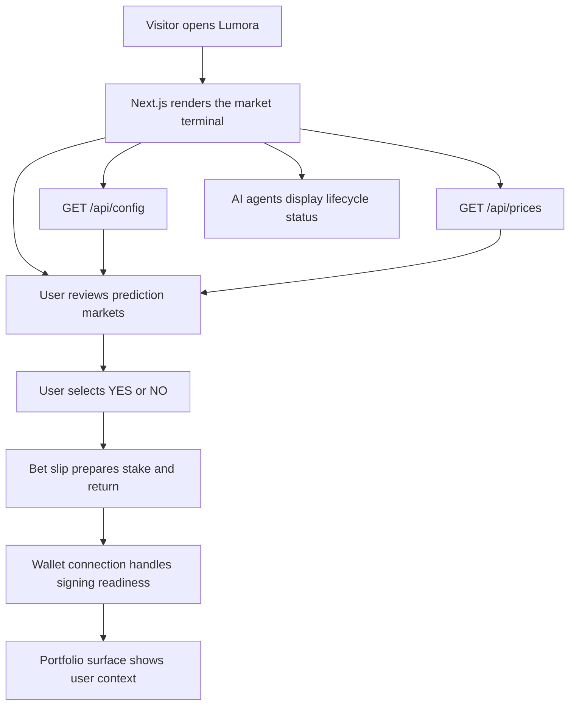

<p align="center">
  
</p>

<h1 align="center">Lumora AI-Powered Prediction Markets</h1>

<p align="center">
  A Solana-native prediction market terminal with AI agents, live crypto market context, wallet entry points, rankings, documentation, and portfolio surfaces.
</p>

<p align="center">
  <a href="#overview">Overview</a> •
  <a href="#features">Features</a> •
  <a href="#architecture">Architecture</a> •
  <a href="#process-flow">Process Flow</a> •
  <a href="#roadmap">Roadmap</a> •
  <a href="#installation">Installation</a> •
  <a href="#configuration">Configuration</a> •
  <a href="#faq">FAQ</a>
</p>

## Overview

Lumora is an AI-powered prediction market interface built around Solana-native trading flows. This repository is aligned with the current public website at [https://www.lumora.cfd](https://www.lumora.cfd), where the product is presented as a fast prediction market terminal rather than a token-only landing page.

The live product narrative is simple: users browse binary crypto markets, AI agents help create and settle markets, and Solana wallets provide the entry point for trading readiness.

## Official Links

- Website: [https://www.lumora.cfd](https://www.lumora.cfd)
- X / Twitter: [https://x.com/Lumora_so](https://x.com/Lumora_so)
- GitHub Repository: [https://github.com/Lumo-sol/Lumora.git](https://github.com/Lumo-sol/Lumora.git)

## Brand Assets

The README logo uses the SVG asset through an HTML image tag because GitHub handles SVG rendering more reliably this way than plain Markdown image syntax.

- Primary SVG logo: [`public/icon.svg`](./public/icon.svg)
- Raster fallback: [`public/logo.jpg`](./public/logo.jpg)

## Features

### User-facing modules

- Header navigation for Markets, Agents, Create, Rank, Docs, and Portfolio
- Copyable contract address display using the live `8888...8888` short format
- Language indicator, notifications, theme toggle, X link, and wallet connection button
- Live crypto ticker powered by `/api/prices`
- Hero section for the AI-powered prediction market narrative
- Prediction market grid with categories, YES / NO outcomes, odds, volume, liquidity, and trader counts
- Sticky live activity panel and bet slip
- AI Agent Hub showing market creation, data oracle, and settlement engine agents
- Natural-language market creation surface with an agent pipeline preview
- Leaderboard, documentation, and portfolio sections
- Mobile bet slip support
- Light and dark theme support

### Backend-facing modules

- `/api/config` for contract address delivery and protected admin updates
- `/api/prices` for market ticker data with fallback-safe static values
- Local JSON runtime config persistence under `data/`
- TypeScript validation for Solana address-like values

## First-Principles MVP Scope

The MVP is built from the smallest set of behaviors needed for a prediction market product to make sense:

1. Users must immediately understand the market question.
2. Users must see both outcomes, current odds, volume, and liquidity context.
3. Users must know where wallet actions begin before any real value flow is enabled.
4. Users must understand how AI agents participate in creation, pricing, and settlement.
5. The product must avoid overstating production readiness before audited on-chain integrations exist.

That is why the current repository prioritizes market browsing, price context, agent visibility, wallet entry, docs, leaderboard, and portfolio surfaces before deeper trade execution.

## Architecture

### Stack

- Next.js 16 App Router
- React 19
- TypeScript
- Tailwind CSS v4
- Radix UI primitives
- Lucide icons
- Local Next.js API routes
- Local JSON persistence for runtime configuration

### Project structure

```text
app/
  layout.tsx
  page.tsx
  api/
    config/route.ts
    prices/route.ts
components/
  agent-hub.tsx
  bet-modal.tsx
  create-market.tsx
  docs-section.tsx
  footer.tsx
  header.tsx
  hero-section.tsx
  language-toggle.tsx
  market-card.tsx
  mobile-bet-slip.tsx
  notification-center.tsx
  portfolio-section.tsx
  prediction-markets.tsx
  price-ticker.tsx
  rank-section.tsx
  sticky-sidebar.tsx
  theme-provider.tsx
  theme-toggle.tsx
  wallet-button.tsx
  wallet-provider.tsx
lib/
  server-storage.ts
  utils.ts
  validators.ts
public/
  icon.svg
  logo.jpg
  wallets/
data/
  .gitkeep
```

## Process Flow



## Functional Modules

### Market layer

- Price ticker
- Market categories
- Market cards
- YES / NO odds display
- Volume, liquidity, and trader signals

### Agent layer

- Market Creator
- Data Oracle
- Settlement Engine
- Agent pipeline preview
- Agent performance metrics

### Trading readiness layer

- Wallet connection modal
- Bet modal
- Mobile bet slip
- Contract address copy action
- Portfolio section

### Trust layer

- Documentation section
- Security notes
- Status messaging
- Config validation
- Clear MVP limitations

## Roadmap

The roadmap starts in April 2026 and follows the public Prediction Markets product direction.

| Date | Phase | Focus | Status |
| --- | --- | --- | --- |
| April 2026 | Phase 01 | Align Git source with the live AI-powered Prediction Markets website | Completed |
| May 2026 | Phase 02 | Expand market cards, category filters, live activity, and bet slip surfaces | Completed |
| June 2026 | Phase 03 | Improve agent hub, market creation, leaderboard, docs, and portfolio sections | Completed |
| July 2026 | Phase 04 | Harden API configuration, pricing fallback behavior, and GitHub handoff readiness | In Progress |
| August 2026 | Phase 05 | Add production persistence, analytics, monitoring, and launch environment integrations | Planned |
| September 2026 | Phase 06 | Add audited on-chain market contracts, policy pages, and production wallet flows | Planned |

## Community and Support

- Website: [https://www.lumora.cfd](https://www.lumora.cfd)
- X / Twitter: [https://x.com/Lumora_so](https://x.com/Lumora_so)

## Installation

### Requirements

- Node.js 20+
- npm 10+ or a compatible package manager

### Install dependencies

```bash
npm install
```

### Start development

```bash
npm run dev
```

### Type check

```bash
npm run typecheck
```

### Production build

```bash
npm run build
```

The build script uses webpack mode for stronger compatibility in restricted environments.

## Configuration

Copy the example environment file and adjust values as needed:

```bash
cp .env.example .env.local
```

Supported variables:

- `ADMIN_PASSWORD`: protects `POST /api/config`
- `DEFAULT_CONTRACT_ADDRESS`: sets the initial Solana contract address shown in the UI

Important:

- `ADMIN_PASSWORD` is required for write access to `/api/config`.
- Runtime config is persisted to local JSON under `data/`.
- Runtime JSON files are local-only artifacts and are ignored by Git.

## API Reference

### `GET /api/config`

Returns the active contract address used by the UI.

Example response:

```json
{
  "contractAddress": "88888888888888888888888888888888"
}
```

### `POST /api/config`

Updates the contract address when the correct admin password is provided.

Example request:

```json
{
  "password": "change-me",
  "contractAddress": "88888888888888888888888888888888"
}
```

### `GET /api/prices`

Returns the token ticker data used by the market context panel.

Example response:

```json
[
  {
    "symbol": "BTC",
    "name": "Bitcoin",
    "price": 94250,
    "change24h": 2.1
  }
]
```

## Usage

### Local development workflow

1. Install dependencies.
2. Add environment variables if needed.
3. Run the development server.
4. Verify the homepage modules against the live website structure.
5. Test contract address copy and wallet modal behavior.
6. Test market card selection, bet slip display, docs tabs, leaderboard, and portfolio empty state.

### Updating the contract address

Use `POST /api/config` with the admin password, or change `DEFAULT_CONTRACT_ADDRESS` in your environment file.

## Project Status

### Current status

- The source now follows the public Prediction Markets website.
- Core market, agent, creation, rank, docs, and portfolio surfaces are included.
- Contract config API is implemented.
- Pricing API is integrated with fallback-safe values.
- Wallet, notification, language indicator, and theme UI surfaces are included.
- README, license, and environment documentation are included.

### Planned next steps

- Replace static market examples with live backend data.
- Connect market actions to audited on-chain contracts.
- Add production persistence for market, activity, and portfolio data.
- Add analytics, monitoring, and deployment environment configuration.
- Add final policy, terms, privacy, and risk disclosure pages.

## Project Highlights

- Git source is aligned with the current public website direction.
- The UI presents the complete prediction market product loop before trade execution is enabled.
- AI agent infrastructure is visible and understandable to new users.
- The codebase keeps comments, identifiers, and documentation in English.
- The project remains easy to deploy, audit, and extend.

## Quality Checklist

- TypeScript checks should pass with `npm run typecheck`.
- Production build should pass with `npm run build`.
- No blank source files should exist outside generated directories.
- User-facing source code and comments should remain English-only.
- Community links should only include official Lumora channels that currently exist.

## Blank File Audit

The repository should be checked for blank project files outside `node_modules` and `.next` before each release. No empty source files are expected in the tracked project tree.

## FAQ

### Is this production-ready?

Not fully. This is an MVP-level web application aligned with the public website. It is suitable for presentation, GitHub handoff, and product iteration, but audited on-chain trade execution is still a planned step.

### Are markets settled on-chain today?

The current repository focuses on the interface and readiness layer. On-chain market execution and settlement should be connected only after contract audits and production backend integrations are complete.

### Why does the project show AI agents?

Agents are central to the Lumora product story. The interface shows how market creation, data validation, odds updates, and settlement can be represented to users in a clear lifecycle.

### Why is the build script using webpack?

Webpack build mode is more reliable than Turbopack in some restricted or sandboxed environments.

## Security Notes

- The wallet modal is a UI integration layer, not a custody system.
- Always verify the contract address before launch.
- Do not enable real trade execution without audited contracts and production monitoring.
- Never treat the MVP interface as financial advice.
- Local JSON persistence is suitable only for MVP runtime configuration. Production deployments should use managed infrastructure.

## License

This project is licensed under the MIT License. See the [LICENSE](./LICENSE) file for details.
